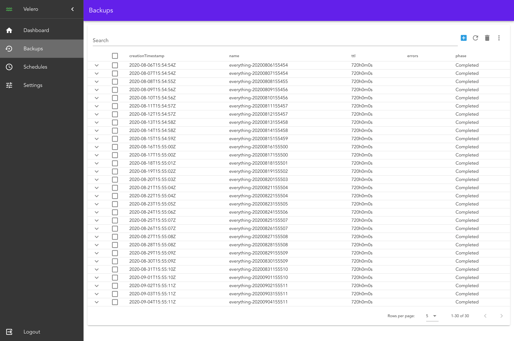

# WIP - velero-ui



## Requirements

Node.js >= 16 (tested with Node 20 and 22) and yarn.

## Project setup
```
yarn install
```

### Compiles and hot-reloads for development

Start the mock API (json-server, port 8081) in one terminal:
```
yarn mock:api
```

Then start the dev server (port 8080) in another one:
```
yarn serve
```

The dev server proxies every `/api` call to the mock API.

### Run local cluster
```
cd /tmp
wget https://raw.githubusercontent.com/tellesnobrega/velero-demo/master/minio.credentials
minikube start
git clone https://github.com/kubernetes-sigs/sig-storage-local-static-provisioner.git 
cd sig-storage-local-static-provisioner/
helm install local-storage --namespace velero ./helm/provisioner
velero backup create backup1

docker build . -t velero-build --target build-stage
docker build . -t velero --cache-from velero-build
docker-compose up -d

kubectl get secret -n velero velero-token-btkdf -o yaml
```

### Compiles and minifies for production
```
yarn build
```

### Run your unit tests
```
yarn test:unit
```

### Run your end-to-end tests
```
yarn test:e2e
```

### Lints and fixes files
```
yarn lint
```
